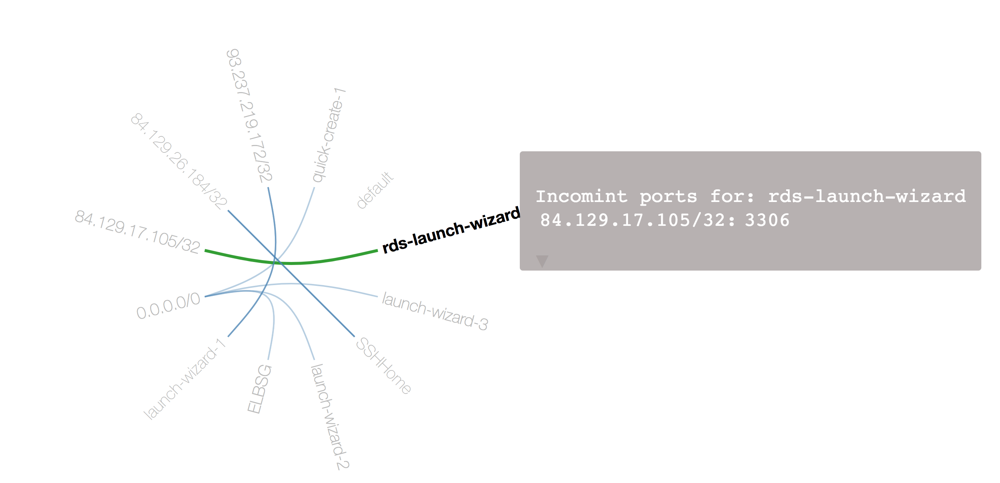

# Visualise Security Groups on AWS

Show security groups in local website with ports. Derived from the work of rowanu, see below. Thank you for the idea and work!

It looks like this:



## Quick Demo

- have node and python 3 installed
- `make demo`
- `make server`

## Configuration

- Edit filter for group names in `extract.js`

```json
var params = {
  Filters: [
    {
      Name: 'group-name',
      Values: [
        '*'
      ]
    }
  ]
}
```

- have AWS cli configured with credentials

## Generation

1) `make init`
Install NPM packages
1) `make generate`
Get security groups from current account.
1) `make server`
Start python 3 local webserver.
1) Open [local webserver](http://localhost:8000)

## Know Limitations

- only shows "fromPort"
- does use not protocol settings

## Differences to Original

- Shows tcp ports as a tip
- Shows also multiple servers for one port


## Original Documentation

[see](https://github.com/rowanu/security-groups-edge-bundling)

## Security Groups Edge Bundling - Original

These are the original scripts used in [my original blog post about visualising
EC2 security
groups](http://blog.rowanudell.com/visualising-ec2-security-groups/).

Unless you really want to run it locally (and do the transforms, etc), you
should use [this tool](https://rowanu.github.io/security-groups-edge-bundling/)
as described in [my redux visualisation
post](http://blog.rowanudell.com/edge-bundling-security-groups-redux/).

## Instructions

You need nodejs to run the script. Once you've extracted the files, run a "npm
install" in the directory, you should be able to run "node index.js" and see
the output - I was just running "node index.js > data.json" to create my data
file. The settings you might need to change are in "extract.js" (which handles
getting the data from the API initially): you'll probably want to change the
region (currently us-east-1) and the security group filter (currently
"*AppName*").
